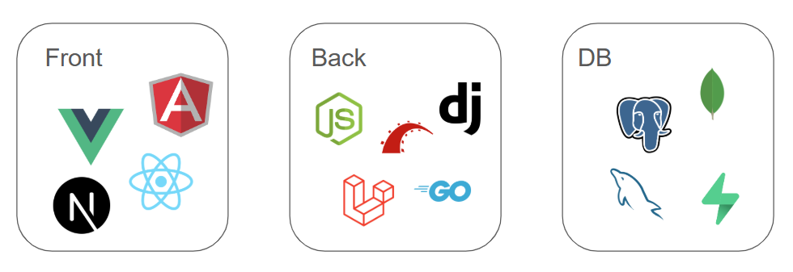

  

    <h1 class="text-7xl font-extralight text-white leading-tight">
      最高の Webアプリを デプロイせよ
    </h1>
    

      さいたまIT・WEB専門学校 
      高橋希尋 | 2025.05.30
    

  

---
layout: center
class: "text-center"
---

  <h1 class="text-4xl font-light text-gray-200">このトークが終わる頃には</h1>

  

    みんなが爆速で 
    Webアプリを作れる 
    ようになってます
  

---
layout: center
class: "text-center"
---

  <h1 class="text-4xl font-light text-gray-200">まずは質問です</h1>

  

    Webアプリを作ったことは 
    ありますか？
  

  

    （IT系の学校なので、みんなありますよね！）
  

---
layout: center
class: "text-center"
---

  <h1 class="text-4xl font-light text-gray-200">どんな技術を使ってますか？</h1>

  

    
    
    
  

---
layout: center
class: "text-center"
---

  <h1 class="text-6xl font-light text-gray-200">Frameworks</h1>

  

    
    
    
  

---
layout: center
class: "text-center"
---

  そもそもWebアプリは 
  どういう構造でできているんだっけ

---
layout: center
class: "text-center"
---

  <h1 class="text-6xl font-light text-gray-200">3 Tiers Architecture</h1>

  

    
  

---
layout: center
class: "text-center"
---

  <h1 class="text-6xl font-light bg-gradient-to-r from-red-400 to-red-200 bg-clip-text text-transparent">当てはめてみると</h1>

  

    
  

---
layout: center
class: "text-center"
---

  <h1 class="text-4xl font-light text-gray-200">そして最大の難関</h1>

  

    デプロイ
  

  

    作るより公開する方が大変...
  

---
layout: center
class: "text-center"
---

  <h1 class="text-4xl font-light text-gray-200">Others ...</h1>

  

    
    
    
    
  

---
layout: center
class: "text-center"
---

  <h1 class="text-4xl font-light text-gray-200">そこで</h1>

  

    
      AI
    
    を活用せよ
  

---
layout: center
class: "text-center"
---

  <h1 class="text-4xl font-light text-gray-200">現代の開発はAIと一緒に</h1>

  

    
    
    
  

  

    もう一人で悩む時代は終わりました
  

---
layout: center
class: "text-center"
---

  <h1 class="text-4xl font-light text-gray-200">AI Driven Development Flow</h1>

  

    

      要件定義
    

    

      テスト駆動プロトタイプ
    

    

      メイン実装
    

    

      CI / CD
    

    

      デプロイ
    

  

---
layout: center
class: "text-center"
---

  実際に私が作ったアプリで紹介します。

---
layout: center
class: "text-center"
---

  <h1 class="text-4xl font-light text-gray-200">ライトニングトーク登録システム</h1>

  

    
  

---
layout: center
class: "text-center"
---

  <h1 class="text-4xl font-light text-gray-200">Next.js推しです（脱線）</h1>

  

    
    
  

  

    Zennの作成者も言ってました
  

---
layout: center
class: "text-center"
---

  ところで、 
  Webアプリを作る本当のメリット

---
layout: center
class: "text-center"
---

  

    就活で
    確実に差がつく
  

  

    Paizaからスカウトも来る！
  

---
layout: center
class: "text-center"
---

  最後に、

---
layout: center
class: "text-center"
---

  <h1 class="text-4xl font-light text-gray-200">最近のAIの進化が止まらない</h1>

  

    
    
  

  

    AIサークル作りたいです（切実）
  

---
layout: center
class: "text-center"
---

  <h1 class="text-4xl font-light text-gray-200">まとめ</h1>

  

    

      
        AI
      
      を味方につけて
    

    

      
        どんどん作ろう
      
    

  

  

    一緒に最高のアプリを作りませんか？
  

