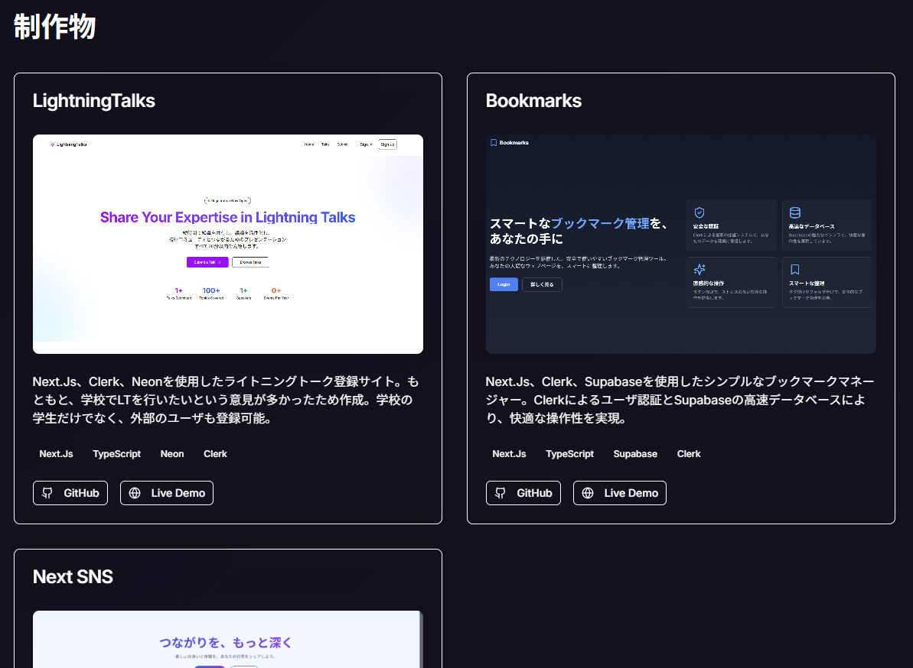
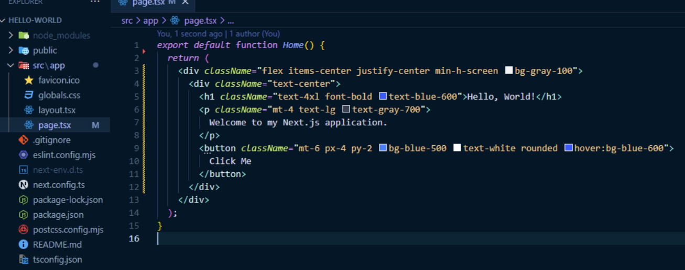
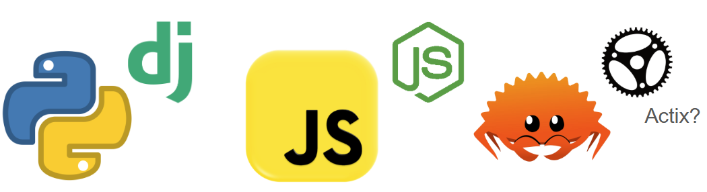
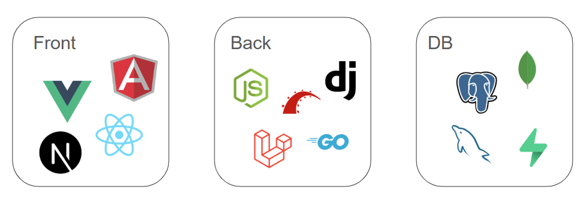
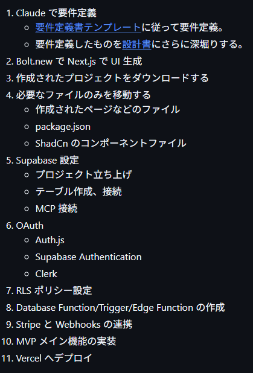
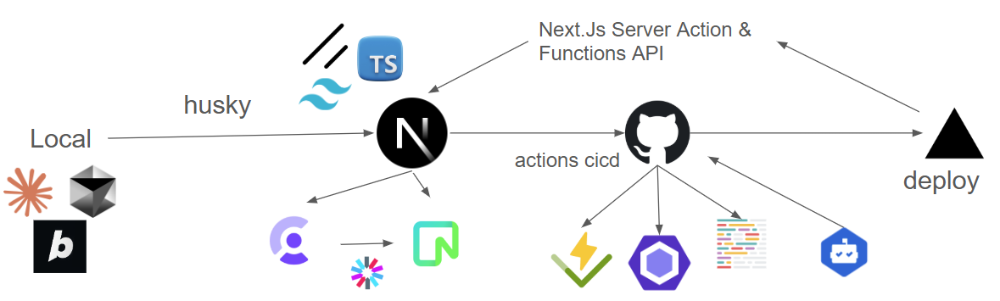

  <h1 class="text-5xl font-bold bg-gradient-to-r from-blue-400 to-purple-500 bg-clip-text text-transparent drop-shadow-lg">5 分で最高の Web アプリをデプロイせよ</h1>

  
    さいたま IT・WEB 専門学校 高度専門士情報技術科 3 年 
    学籍番号 23010025 
    高橋希尋 
    2025/05/30
  

---

# はじめに

  

5 分後には

5 分で最高の Web アプリが作れるようになってます！

---

# さっそく皆さんに質問

  

Web アプリを作成したことはありますか？

（まあ、ここにいる皆さんはありますよね！！）

---

# じゃあ、デプロイは？？

  

デプロイは？コード管理は？認証は？

面倒なことは多いです

---

# ちなみに、どんなスタックを使っていますか？

  

学校で習ったものを使ったり、自分で勉強して作ってますよね

---

# そもそも Web アプリはどういう構造？

  

 「3 層アーキテクチャ」 という言葉を一度は聞いたことがあるはず

---

# さっきのやつを当てはめるとこうなる

  

3 層アーキテクチャに基づくアプリ作成に

必要なスタックはこんなにもいっぱいある

---

# AI を活用せよ

## コード書くなら Claude いいよ

  
  

  
  

---

# 現段階の AI 駆動開発の最高効率

## 異論は認める

  
  

---

# 私はこう作った(こう作りたいを含める)

  

ライトニングトークを登録できるサイトを

作成した際に使ったスタックの一覧

---

# (脱線) Next.Js は React の上位互換である！

  
  
  

React なんて時代遅れ！ Next.Js は最新技術とかっこよさの塊

Zenn を作った人も絶賛してた

---

# Web アプリを作るメリット

  

最初は結構難しくて予期せぬエラーでコケることも

企業へのアピールになるし、Paiza でスカウト来ます

---

# おまけ

## 最近の AI の進化すごくない！？

  
  
  

AIサークル作りたいなあ

---

# **まとめ**

  

これからはみんなの出番。どんどん作って

というか一緒に作ろうよ。

