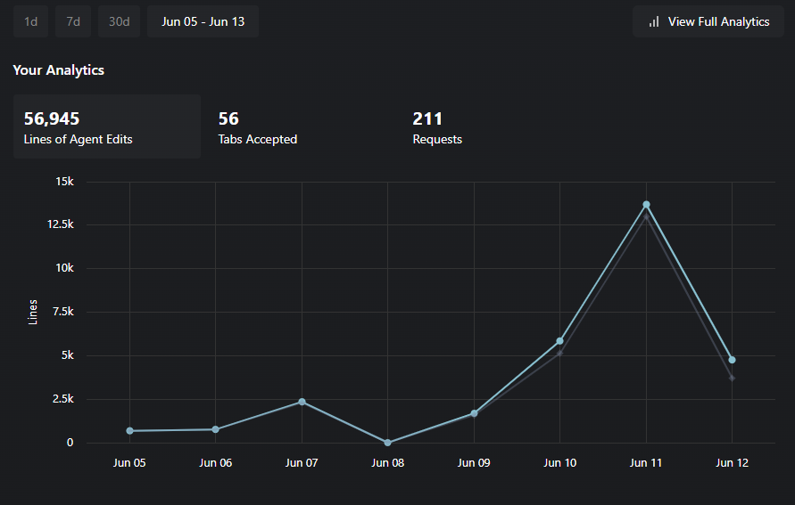

# AI 開発駆動の最先端について

#### Presenter: lvncer

#### 2025/06/30

---
layout: center
class: "text-center"
---

  <h1 class="text-4xl font-light text-gray-200">Agenda</h1>

  

    
1. Vibe Coding

    
2. AI Models

    
3. Cursor Editor

    
4. MCP (Model Context Protocol)

    
5. Claude Code

    
6. Pull Request Reviews

    
7. Summary

  

---
layout: center
class: "text-center"
---

  <h1 class="text-6xl font-light bg-gradient-to-r from-blue-400 to-purple-400 bg-clip-text text-transparent">
    1. Vibe Coding
  </h1>

---
layout: center
class: "text-center"
---

  

    
  

---
layout: center
class: "text-center"
---

  <h1 class="text-4xl font-light text-gray-200">AI Driven Development</h1>

  

    
  

---
layout: center
class: "text-center"
---

  <h1 class="text-4xl font-light text-gray-200">My Vibes...</h1>

  

    
  

---
layout: center
class: "text-center"
---

  <h1 class="text-6xl font-light bg-gradient-to-r from-red-400 to-blue-400 bg-clip-text text-transparent">
    2. AI Models
  </h1>

---
layout: center
class: "text-center"
---

  <h1 class="text-4xl font-light text-gray-200">OpenAI</h1>

  

    
  

  

    推論能力が圧倒的
  

---
layout: center
class: "text-center"
---

  <h1 class="text-4xl font-light text-gray-200">Google</h1>

  

    
  

  

    マルチモーダル対応が強力
  

---
layout: center
class: "text-center"
---

  <h1 class="text-4xl font-light text-gray-200">Anthropic</h1>

  

    
  

---
layout: center
class: "text-center"
---

  <h1 class="text-5xl font-light text-purple-400">コーディング最強はClaude 4 Sonnet!!</h1>

  

    
複雑なリファクタリングも一発

    
コンテキスト理解が異次元

    
バグ修正の精度が人間を超える

  

---
layout: center
class: "text-center"
---

  <h1 class="text-4xl font-light text-gray-200">Local LLMs</h1>

  

    
    
    
  

---
layout: center
class: "text-center"
---

  <h1 class="text-4xl font-light text-gray-200">次世代完全自立 Agents</h1>

  

    

      
    

    

      
    

  

  

    

      
$500/month

    

    

      
$199/month

    

  

---
layout: center
class: "text-center"
---

  <h1 class="text-6xl font-light bg-gradient-to-r from-blue-400 to-green-400 bg-clip-text text-transparent">
    3. Cursor Editor
  </h1>

---
layout: center
class: "text-center"
---

  <h1 class="text-6xl font-light">
    その前に
  </h1>

---
layout: center
class: "text-center"
---

  <h1 class="text-4xl font-light text-gray-200">VSCodeは波に乗れてない</h1>

  

    
  

  

    
AIファーストの設計思想が必要

    
OSS化するしこれからかも

  

---
layout: center
class: "text-center"
---

  <h1 class="text-6xl font-light">
    Cursor は何が違うか
  </h1>

---
layout: center
class: "text-center"
---

  <h1 class="text-4xl font-light text-gray-200">Cursor Rules</h1>

  

    
  

  

    
プロジェクト固有のコーディング規約をAIに学習させる

    
チーム全体で一貫したコードスタイル

  

---
layout: center
class: "text-center"
---

  <h1 class="text-4xl font-light text-gray-200">Background Agent</h1>

  

    
  

  

    
バックグラウンドで完全自立、並列駆動可能

    
オフラインでも使用可

  

---
layout: center
class: "text-center"
---

  <h1 class="text-4xl font-light text-gray-200">敵対AI IDEとの勝負</h1>

  

    

      
      
Windsurf

      
OpenAIとClaudeに見捨てられたIDEとは...

    

    

      
      
Jules

      
Google発の完全自立型エージェント

    

  

---
layout: center
class: "text-center"
---

  <h1 class="text-6xl font-light bg-gradient-to-r from-purple-400 to-pink-400 bg-clip-text text-transparent">
    4. MCP
  </h1>
  

    Model Context Protocol
  

---
layout: center
class: "text-center"
---

  <h1 class="text-4xl font-light text-gray-200">MCPとは？</h1>

  

    
  

  

    
AIモデルと外部システムを繋ぐ標準プロトコル

    
Anthropicが主導する業界標準化の取り組み

  

---
layout: center
class: "text-center"
---

  <h1 class="text-5xl font-light text-red-400">Game Breakerである</h1>

  

    
  

  

    
既存システムとの統合が簡単

    
AIの能力を無限に拡張可能

  

---
layout: center
class: "text-center"
---

  <h1 class="text-4xl font-light text-gray-200">便利なサーバー</h1>

  

    

      FileSystem
      Github
      Supabase / Neon
      Figma
      PlayWright
      etc...
    

  

---
layout: center
class: "text-center"
---

  <h1 class="text-4xl font-light text-gray-200">Github MCP's Flow</h1>

  

    
1. Issue

    
2. Branch

    
3. Phase

    
4. Commit

    
5. PR

    
6. Merge

  

---
layout: center
class: "text-center"
---

  <h1 class="text-6xl font-light bg-gradient-to-r from-indigo-400 to-purple-400 bg-clip-text text-transparent">
    5. Claude Code
  </h1>

---
layout: center
class: "text-center"
---

  <h1 class="text-4xl font-light text-gray-200">CLI上で動くAI開発環境</h1>

  

    
  

  

    
一気通貫で完全自立、並列駆動可能

  

---
layout: center
class: "text-center"
---

  <h1 class="text-4xl font-light text-gray-200">料金体制</h1>

  

    

      
Pro/Max Plan

      
月額定額で使い放題

    

    

      
API

      
従量課金、大量利用向け

    

  

---
layout: center
class: "text-center"
---

  <h1 class="text-5xl font-light text-yellow-400">超人気である</h1>

  

    
開発者コミュニティで話題沸騰

    
企業導入も急速に拡大

  

---
layout: center
class: "text-center"
---

  <h1 class="text-4xl font-light text-gray-200">超最先端「AI Company」とは？</h1>

  

    
  

---
layout: center
class: "text-center"
---

  <h1 class="text-6xl font-light bg-gradient-to-r from-green-400 to-blue-400 bg-clip-text text-transparent">
    6. Pull Request Reviews
  </h1>

---
layout: center
class: "text-center"
---

  <h1 class="text-4xl font-light text-gray-200">Claude Code Actions</h1>

  

    
  

  

    
Claudeによる最高性能のレビュー

    
イシューを立てれば実装機能も

  

---
layout: center
class: "text-center"
---

  <h1 class="text-5xl font-light text-gray-200">Code Rabbit</h1>

  

    
  

  

    
API接続で様々なAIレビューが可能

  

---
layout: center
class: "text-center"
---

  <h1 class="text-4xl font-light text-gray-200">Cursor BugBot</h1>

  

    
  

---
layout: center
class: "text-center"
---

  <h1 class="text-6xl font-light bg-gradient-to-r from-yellow-400 to-red-400 bg-clip-text text-transparent">
    7. Summary
  </h1>

---
layout: center
class: "text-center"
---

  <h1 class="text-4xl font-light text-gray-200">「AIに使われる」とは明らかな矛盾である。</h1>

---
layout: center
class: "text-center"
---

  <h1 class="text-4xl font-light text-gray-200">「AIを使いこなす人間」に使われる。</h1>

---
layout: center
class: "text-center"
---

  <h1 class="text-4xl font-light text-gray-200">AI時代で生き残るには</h1>

  

    AIを使いこなす側に回る
  

---
layout: center
class: "text-center"
---

  <h1 class="text-4xl font-light text-red-400">一度、遅れを取るとついていけなくなる</h1>

  

    
技術進歩のスピードが指数関数的

    
学習コストは今後さらに増大

  

---
layout: center
class: "text-center"
---

  

    
      Vibe Coder
    
    
      になれ！
    
  

  

    感覚で最高のコードを書く時代
  

---
layout: center
class: "text-center"
---

  <h1 class="text-6xl font-light text-gray-200">ありがとうございました</h1>

  

    質問・ディスカッションタイム
  

