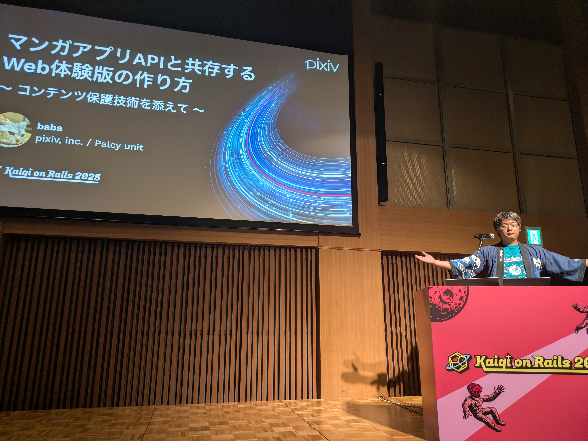

  <h2 class="text-4xl font-bold mb-4">AI話とアウトプット時代について</h2>
  
Takahashi Kihiro

---

  <h1 class="text-4xl font-bold">Agenda</h1>

  <ol class="text-xl">
        <li>ちょっと余談（アイスブレイク）</li>
    <li>激動の8-9月！AIニュース振り返り</li>
    <li>最新情報はXかニュースサイトでキャッチせよ！</li>
    <li>もう見てるだけじゃ、もったいない！ アウトプットのすすめ</li>
    <li>まとめ</li>
  </ol>

---

  <h1 class="text-4xl font-bold">1. ちょっと余談（アイスブレイク）</h1>

  

    

      
こないだKaigi on Rails 2025に行ってきました

    

    

      
Rubyわからない人でも、ORMや権限設定とか、Webの基本的なセッションもありました

    

    

      
あとで記事を上げる予定なので興味があれば見てください

    

  

---

  <h1 class="text-4xl font-bold">Pixivさんに招待していただきました</h1>

  

    
  

  

    

      
    

  

---

  <h1 class="text-4xl font-bold">2. 激動の8-9月！AIニュース振り返り</h1>

  <h1 class="text-4xl font-bold mb-8"></h1>
  

    

      
🚀 この2ヶ月でAI界隈は本当に激変！

      <a href="https://x.com/kihhi_" class="text-lg text-gray-600">x.com/kihhi_</a>
    

  

---

  <h1 class="text-4xl font-bold mb-8">3. 最新情報はXかニュースサイトでキャッチせよ！</h1>
  

    

      

        
1. ⭐️null-sensei @GOROman

        
2. ⭐️ぬこぬこ | NUKO @schroneko

        
3. ⭐️Yasuhiro Arai(AI駆動開発勉強会主催) @kimotuki

        
4. 手羽先 | 国産LLMを作る人 @Tebasaki_lab

        
5. オカムラ | 株式会社メイク・ア・チェンジ @masa_oka108

        
6. yuma (Maki) @yuma_prog

        
7. Taishi🚀元シリコンバレーCTO個人開発者 @taishi_jade

        
8. 鹿野 壮 Takeshi Kano @tonkotsuboy_com

        
9. nogu @\_nogu66

        
10. Shotaro Suzuki @shosuz

        
11. takuya, PhD // @tnir CTO at stmn / GitLab Core @takuya_stmn

      

    

    

      

        
12. taiga @taiga_kk322

        
13. asap @asap2650

        
14. HiMorishige @\_himorishige

        
15. Shu @NGO275

        
16. Günther | グンタ @gunta85

        
17. Asahi @asahiXXXXXXXXX

        
18. ⭐️Kuu🍣 @Fumiya_Kume

        
19. ⭐️Kinopee / きのぴー @kinopee_ai

        
20. ⭐️みのるん☁️ Minoru Onda @minorun365

        
21. 大塚あみ/ Ami @AmiOtsuka_SE

        
22. 安東竜平 | Link AI @airunner_linkai

        
23. ⭐️Oikon @oikon48

        
24. 神威/KAMUI @kamui_qai

        
25. azukiazusa @azukiazusa9

      

    

  

---

  

  

    <h2 class="text-2xl font-bold">ニュースサイト</h2>
    

      
GIGAZINE

      
ITmedia

      
PC watch

      
ギズモード・ジャパン

      

      
The Verge

      
日本経済新聞

    

  

  

    <h2 class="text-2xl font-bold">Youtube</h2>
    

      
テレ東AIアカデミー【公式】 @TXAIacademy

      
ムーザルちゃんねる @moozaru

    

  

  

    <h2 class="text-2xl font-bold mb-4">Connpass</h2>
    

      
AIAU (AI Agent Users) https://aiau.connpass.com/

      
AI 駆動開発勉強会 https://aid.connpass.com/

    

  

  

---

  <h1 class="text-4xl font-bold">4. もう見てるだけじゃ、もったいない！アウトプットのすすめ</h1>

  

    

      
みんなインプットはめちゃくちゃ頑張ってると思う

    

    

      
「でも、その知識、頭の中に入れておくだけじゃ、いつか忘れちゃうし、自分の中で完結しちゃう。それって、めっちゃもったいない！」

    

    

      
特に今はAIの発達で人間から知識を得る必要性も減り、今後はもっと進む

    

  

---

  <h1 class="text-4xl font-bold">なんでアウトプット？</h1>

  

    

      <h2 class="text-2xl font-bold mb-4">💡 知識の整理・定着</h2>
      
「人に説明しようとしたり、記事にまとめようとすると、『あれ、自分ここ理解してなかったな』って気づけるんだよね。これが一番知識が定着する方法だと思う！」

    

    

      <h2 class="text-2xl font-bold mb-4">🤝 仲間との繋がり</h2>
      
「アウトプットすると仲間が見つかる！SNSで『それ面白い！』ってコメントもらえたり、イベントで話しかけてもらえたり…。一人で学ぶより、100倍楽しいよ！」

    

  

---

  <h1 class="text-4xl font-bold">じゃあ、何をすれば？ベビーステップから提案！</h1>

  

    

      <h3 class="text-xl font-bold mb-2">Lv.1 SNSで一言ポスト</h3>
      
「今日このLTで学んだこと、みたいにハッシュタグつけてポストする。これだけでも最高のアウトプット！」
      

      
勇気があれば引用リツイートも超おすすめ

    

    

      <h3 class="text-xl font-bold mb-2">Lv.2 ブログや記事を書いてみる</h3>
      
「ZennとかQiitaに『〇〇APIを使ってみた』みたいな記事を書く！最初は誰かの記事の写経でも全然OK！」

    

    

      <h3 class="text-xl font-bold mb-2">Lv.3 簡単なアプリ作成</h3>
      
ChatGPTのAPIを使ってLINE Bot作るとか、身の回りのちょっとした不便を解決するツールを作ってみると、めっちゃ楽しいしスキルも身につく

      
デプロイして誰でも見れる状態にするのがベスト

    

    

      <h3 class="text-xl font-bold mb-2">Lv.4 イベント参加＆登壇</h3>
      
「今日みたいにw LTは5分とかだから、意外とハードル低い！まずは参加者として雰囲気を味わうだけでも大きな一歩！」

    

  

---

>
  <h1 class="text-4xl font-bold">Lv.5 コミュニティ参加＆運営</h1>

  

    
「同じ趣味の仲間と話すだけでも刺激になる！

    
もっと積極的に関わりたいなら、運営に挑戦してみるのもアリ！」

  

---

  <h1 class="text-4xl font-bold">5. まとめ</h1>

  

    

      
8-9月のAIも超ヤバかった！

    

    

      
インプットしたら、どんな小さなことでもアウトプットしよう！

    

    

      
まずはこのLTの感想ポストから！

      
#siw_lt

    

  

---
layout: center
---

# ご清聴ありがとうございました！
